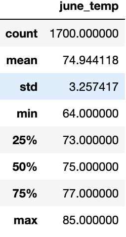

# Surfs_up Analysis
## A) Overview
This analysis utilizes the advanced storage and retrieval tools to extratct and transform data to produce analysis for tempreture trends in Hawaii. The summary statistics of temprture data for the month of June and December presented to identify the temprture trends in order to determine whether the surf and ice cream shop business can operate a year-round business. a seasonal business.

## Resources
Data Source: hawaii.sqlite
Programming Files: SurfsUp_Challenge.ipynb, climate_analysis.ipynb
Data Tools: Python SQL toolkit (SQLAlchemy), Object Relational Mapper, pandas, numpy
Software: SQLlite, Python 3.9.2, Jupyter Notebook

## Deliverables:
1. Determine the Summary Statistics for June
2. Determine the Summary Statistics for December

## Results:

Summary Statistics DataFrame: June vs December Temperatures

June Temps Visualization (Temperature and Frequency)

December Temps Visualization (Temperature and Frequency)

Key Differences in Weather: Hawaii

- Average temperature in June is 75 degrees F, 4 degrees higher than the average temp in December i.e. 71 degrees.
- Temperatures frequency in  June tends to have a normal distrbution with the smaller standard deviation.
- Tempreture frequency in December tends to be relatively more variable taking into account tha max and min temprtures and the measured standard deviation.
